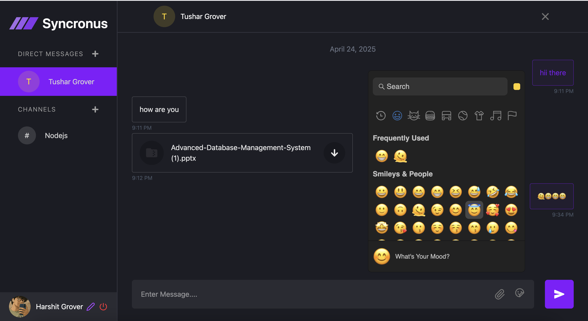

# 💬 Chat-App

A real-time chat application built with the **MERN stack** (MongoDB, Express, React, Node.js) using **WebSockets** for instant messaging and **emoji picker** integration for a fun and engaging chat experience.

---

## 🚀 Overview

Chat-App is a full-stack messaging platform where users can communicate in real-time. With a modern interface, emoji reactions, and robust group chat support, this app delivers a smooth and interactive messaging experience.

---

## 🧩 Features

- 🔐 **User Authentication** (Login/Register)
- 💬 **Real-Time One-on-One & Group Messaging** using WebSockets
- 😊 **Emoji Picker** integration with `emoji-picker-react`
- 👥 **Group Chat Support** – create, join, and message in groups
- 🟢 **Online/Offline User Status**
- 📜 **Persistent Chat History** stored in MongoDB
- 🌓 **Responsive UI** optimized for all devices

---

## 🛠️ Tech Stack

**Frontend:**
- React
- Axios
- emoji-picker-react
- Socket.IO Client

**Backend:**
- Node.js
- Express
- MongoDB
- Socket.IO Server
- Mongoose
- JWT for Authentication

**Database:**
- MongoDB (Cloud Hosted via MongoDB Atlas)

---

## 📷 Screenshots

> 📸 Add these screenshots to the `/screenshots` folder and update the paths if needed.

### 🖥️ Chat Interface


### 👥 Group Chat View


### 🔐 Login Page


### 😎 Emoji Picker in Action


---

## 🔧 Setup Instructions

```bash
# Clone the repository
git clone https://github.com/yourusername/chat-app.git
cd chat-app

# Set up backend
cd backend
npm install
# Add your .env file with MongoDB URI, JWT_SECRET, etc.
npm start

# Set up frontend
cd ../frontend
npm install
# Add your VITE_BACKEND_URL in .env
npm run dev
